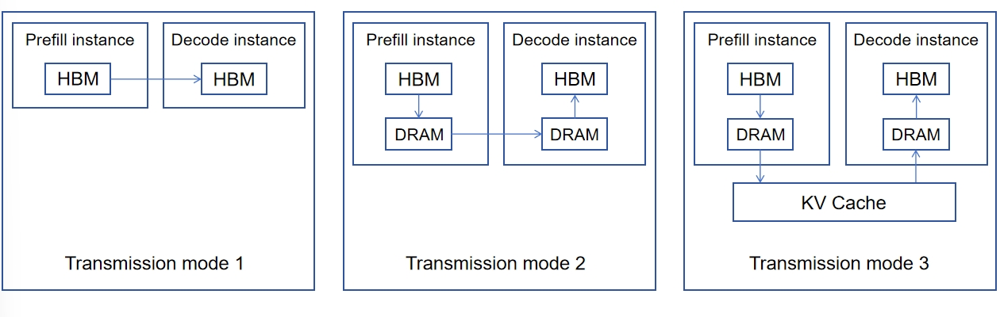

# PD Disaggregation

The Disaggregation of Prefill and Decode (PD Disaggregation) has basically become a consensus solution for the
deployment of
large-scale inference clusters, and its advantages are even more prominent, especially for Mixture of Experts (MOE)
models. PD Disaggregation mainly includes three core components: **independent deployment strategies for Prefill and Decode**,
**KV cache storage and transmission strategies**, and **scheduling strategies**. Notably, the scheduling strategy is dependent
on the KV cache storage and transmission strategy. The PD Disaggregation design in UCM focuses
primarily on optimizing KV cache storage and transmission, thereby enabling more rational scheduling strategies.

Prefix Cache has become a standard component in inference systems. With the expanding application scope of large language models (LLMs),
the increase in sequence lengths, and the growing adoption of Agent-based applications, the performance benefits of
Prefix Cache will become even more significant. The PD Disaggregation in UCM takes Prefix Cache as a foundational
assumption and is inherently dependent on its functionality.

## Transmission Modes of KV Cache Between Prefill and Decode Nodes

There are roughly three transmission modes for KV cache between Prefill (P) and Decode (D) nodes, each with distinct
characteristics and application scenarios:

1. **Direct Transmission**. KV cache is transmitted directly from the High-Bandwidth Memory (HBM) of the Prefill node to
   the HBM of the Decode node, typically via a high-speed inter-HBM network or a direct pass-through protocol. This
   approach is straightforward and efficient, making it highly suitable for scenarios with a 1:1 Prefill-to-Decode
   ratio (1P1D) and homogeneous P/D nodes. On the scheduling side, coordination is usually required: Prefill and Decode
   nodes are allocated at the initiation of a request to enable layer-wise KV transmission during the Prefill phase.
2. **Indirect Transmission via DRAM**. First, the KV cache generated during the Prefill phase is offloaded to Dynamic
   Random-Access Memory (DRAM). Subsequently, the KV cache is transferred from the Prefill node’s DRAM to the Decode
   node’s DRAM, and finally loaded from the Decode node’s DRAM into its HBM for inference. In this mode, DRAM acts as a
   logical cache, which is more compatible with scheduling logic. Critically, HBM is only occupied for the shortest
   duration in the entire process, effectively reducing HBM resource consumption.
3. **Transmission via Unified Storage Pool (Leveraging Prefix Cache Logic)**. This mode fully utilizes Prefix Cache
   logic, with a unified storage pool serving as the intermediate medium for KV cache transmission. Specifically, the
   Prefill node offloads KV cache to the storage, while the Decode node performs inference with high hit rates on
   the Prefix Cache. Compared with the first two modes, this approach is the "simplest" in terms of logic and
   implementation, and achieves the highest degree of decoupling in the entire system, even eliminating the need for a
   strict distinction between Prefill and Decode nodes.

<figure>
  
  <figcaption>Figure 1: Three transmission modes for KV cache between Prefill and Decode nodes</figcaption>
</figure>

### Rationale for UCM’s Adoption of the Third Transmission Mode

The "simplicity" and "decoupling" of the third mode are sufficient to make it the preferred choice for UCM. In practical
implementations, additional advantages have been identified:

1. **Complete Decoupling of Prefill and Decode**: This not only simplifies scheduling logic but also greatly streamlines
   exception handling.
2. **Full Reuse of Prefix Cache Code**: It serves as a "time-saver" for developers, as no additional PD
   Disaggregation-specific logic needs to be added. Consequently, there is no need to address the cumbersome exception
   handling issues associated with custom logic.
3. **Unified Storage as Inference Instance State**: This design renders inference instances completely stateless,
   significantly enhancing the robustness of the entire system.
4. **Near-Zero-Cost Heterogeneous Inference**: Due to inherent differences between Prefill and Decode tasks, optimizing
   cost can be achieved by selecting different graphics processing units (GPUs), precision levels, instance launch
   methods, and optimization algorithms. While direct inter-GPU transmission becomes more complex in heterogeneous
   environments, the Disaggregation of KV cache and computation either natively supports such scenarios or only requires
   the
   addition of a fully decoupled module. Over time, large inference clusters composed of new and old GPUs with diverse
   architectures will naturally become a mainstream trend.

In large-scale clusters, the direct transmission mode (Mode 1) requires either a full connection between Prefill and
Decode nodes or further division of nodes into smaller groups. This not only increases the complexity of network design
and scheduling but also limits the maximum scalable size of the cluster. In contrast, larger and more unified clusters
are more conducive to improving overall throughput.

## Enhanced Scheduling Flexibility Enabled by PD Disaggregation

The flexible decoupling of PD Disaggregation provides greater flexibility for scheduling optimization. Key application
scenarios include the following:

**1. Reducing GPU Compute Idle Time and Maximizing Compute Utilization**

- Under Data Parallelism (DP) in Dynamic Batching, the scheduler merges sequences of different lengths to reduce idle time caused by DP,
  with task migration performed midway if necessary.
- The scheduler leverages Chunked Prefill to utilize residual compute resources on Decode instances.
- By default, the scheduler stores KV cache generated from each inference task in a unified external memory. This not
  only avoids recomputation in case of exceptions but also maximizes system-wide compute utilization through mid-task
  migration.
- The scheduler automatically switches the roles of Prefill and Decode nodes to further exploit underutilized compute
  resources.
- When system bandwidth is insufficient, the scheduler triggers additional recomputation to avoid bandwidth bottlenecks.
- The scheduler balances the load across all instances, maximizing compute utilization while improving user experience.
- During high-priority task preemption, the scheduler enables seamless migration of existing tasks to new instances.

**2. Improving User Experience**

- The scheduler prevents long sequences from delaying short sequences (which would degrade the experience of
  short-sequence tasks), thereby improving average Time to First Token (TTFT) and Time per Output Token (TPOT).
- The scheduler uses simple hashing to map requests from the same user to the same instance as much as possible,
  increasing the local hit rate of KV cache and reducing both TTFT and bandwidth consumption.

**3. Enhancing Exception Handling**

- The scheduler implements mechanisms such as retries and checkpoint-based resumption to handle exceptions, preventing
  task errors and failures.
- The scheduler itself is designed with weak state and multi-instance redundancy, eliminating single points of failure
  and reducing system-level risks.

## Evolution and Future Outlook of PD Disaggregation

Since its initial proposal, PD Disaggregation has evolved toward greater complexity with the widespread adoption of Deepseek
MLA MOE models. This evolution has led to discussions about more granular Disaggregation strategies, such as
Activation-Feedforward (AF) Disaggregation and layer-wise Disaggregation. It is undeniable that these more complex approaches
can further reduce compute idle time (e.g., idle time caused by DP) and fully exploit compute resources.

However, it is important to recognize that large-model inference is still in its early stages, and PD Disaggregation
represents only the starting point for the transition toward large-scale distributed inference deployment. As more
application scenarios emerge, there will be an inevitable demand for stricter and stricter Service-Level Agreements (SLAs) and more
robust handling of extreme edge cases. Currently, simpler architectural designs (such as the third KV transmission mode
adopted by UCM) can provide greater design redundancy for more complex and effective solutions in the future. For
example, when implementing checkpoint-based resumption and offline inference, it has been found that these
functionalities can be extremely easily integrated into a simple architecture.

UCM’s understanding of PD Disaggregation remains rooted in the principles of "**simplicity**" and "**decoupling**", to the extent
that it may even sacrifice a certain degree of performance to preserve these core advantages.

:::{toctree}
:maxdepth: 2
centralized_pd.md
distributed_pd.md
large_scale_ep.md
:::

