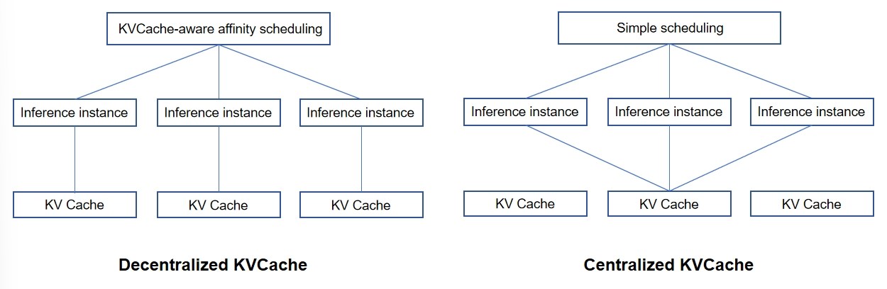

# Prefix Cache

## Prefix Cache: A Fundamental Acceleration Component for KVCache and Its Architectural Considerations in Large Language Model Inference

As the simplest and most fundamental acceleration feature of KVCache, Prefix Cache has achieved industry-wide consensus.
With the expanding application scope of large language models (LLMs), the growth of sequence lengths, and the
proliferation of Agent-based applications, the performance gains of Prefix Cache become even more pronounced. Serving as
the default capability for KVCache applications, Prefix Cache also lays the foundation for the PD disaggregation by UCM.
Concurrently, it imposes a requirement that sparse algorithms must support Prefix Cache.

The core performance metric of Prefix Cache is the hit rate, and there exists a direct positive correlation between
cache capacity and hit rate. Taking the publicly released data from DeepSeek and Kimi as examples, a relatively large
cache capacity is required to reach the "hit rate sweet spot". In terms of input/output (IO) characteristics, Prefix
Cache primarily demands bandwidth-intensive IO, making it well-suited for storage on Solid-State Drives (SSDs).

Prefix Cache can leverage diverse storage media, including High-Bandwidth Memory (HBM), Dynamic Random-Access Memory (
DRAM), SSDs, and dedicated storage systems (e.g., DeepSeek’s 3fs, a storage system specifically developed for KVCache).
The fundamental design philosophy involves constructing a **multi-level cache** hierarchy using HBM, DRAM, local SSDs,
and remote storage. In practice, the implementation of this hierarchy can be roughly categorized into two architectural
directions:

- **Decentralized Architecture**: KVCache is deployed in an isolated manner for each inference instance, with each
  KVCache
  partition belonging to a distinct inference instance (or server). This distributed KVCache deployment is typically
  paired with upper-layer KVCache-aware affinity scheduling. The goal of such scheduling is to route inference requests
  to instances with higher KVCache hit rates, thereby maximizing overall system performance.
- **Centralized Architecture**: KVCache is stored in a centralized external storage system and shared across all
  computing
  nodes. This architecture features inherent simplicity; DeepSeek’s 3fs adopts this design paradigm, and the Prefix
  Cache module in UCM also tends to prioritize this centralized approach.

<figure>
  
  <figcaption>Figure 1: Two hierarchical structures of KVCache in Prefix Cache</figcaption>
</figure>

## Rationale for Adopting DeepSeek’s Centralized Approach Over Dynamo’s Decentralized Design

The decision to adopt DeepSeek’s centralized architecture (rather than Dynamo’s decentralized scheme) is driven by the
following key considerations, which align with UCM’s core design principles:

1. **Adherence to UCM’s First Foundational Principle: "Simplicity"**. A core tenet guiding UCM’s design is "avoiding
   unnecessary investments in features that do not yield substantial benefits". Affinity scheduling, however, is not a
   trivial module to implement. Most decentralized implementations require each inference instance to feed back KVCache
   management status to the scheduler to enable the scheduler to predict hit rates for requests routed to different
   instances. Additionally, the scheduler must balance these hit rates against the load of each instance, introducing
   significant complexity.

2. **Compliance with UCM’s First Derived Principle: "Decoupling"**. In decentralized architectures, inference instances
   are required to report KVCache status to the scheduler. This breaks the independence of individual instances,
   introducing coupling between upper-layer scheduling and lower-layer inference components—an outcome explicitly
   avoided in UCM’s design. It is important to emphasize that UCM’s design is governed by only two principles: "
   Simplicity" serves as the only axiom, while "Decoupling" is regarded as the first derived theorem.

3. **Cost-Benefit Analysis: Insufficient Gains to Justify Principle Violations**. UCM’s evaluation indicates that
   decentralized KVCache does not deliver benefits significant enough to offset the trade-offs of violating the "
   Simplicity" and "Decoupling" principles. The primary purported advantages of decentralized KVCache—reduced KVCache
   network bandwidth consumption and lower latency. However, it's hard to achieve these two benefits under the PD-disaggregated architecture. Moreover, when
   compared to improvements in Time-to-First-Token (TTFT), the latency reduction benefits of decentralization are
   marginal.

4. **Facilitation of Commercial-Grade Inference Solutions**. Decentralized KVCache introduces additional complexity in achieving fault tolerance and supporting multi-instance deployment. To advance toward a "commercially viable inference solution", UCM
   prioritizes architectures that are structurally simple and robust to anomalies.

5. **Mitigation of Data Silos**. Decentralized KVCache inherently creates data silos: redundant KVCache data accumulates
   across isolated instances, and the limited capacity of individual silos constrains the overall Prefix Cache hit
   rate, undermining a key performance objective.

6. **Enhanced Compatibility with PD Disaggregation and Large-Scale Deployment**. The centralized architecture exhibits
   superior compatibility with the PD-disaggregated paradigm and is more scalable for large-scale inference deployments, a
   critical requirement for industrial-grade LLM applications.

It is important to note that the distinction between decentralized and centralized architectures is not absolute. For
instance, some decentralized implementations integrate remote storage to augment capacity, and UCM similarly leverages
DRAM as a high-speed cache tier. The core difference lies in architectural priority: in decentralized designs, affinity
scheduling is a high-priority requirement (as it directly impacts KVCache hit rates); in centralized designs, however,
affinity scheduling is demoted to a low-priority consideration, affecting only TTFT rather than core hit rate
performance.

:::{toctree}
:maxdepth: 1
pipeline_store
nfs_store
ds3fs_store
compress_store
:::