# DramPool Metrics 指标速查手册（32 个）

> 权威规格（埋点实现细节、回流链路、配置、测试方案）见同目录 [metrics_design.md](metrics_design.md)；本文件为开发/运维速查摘要。
>
> 功能描述统一三段式：**测什么**（观测口径）→ **反映什么**（异常时指向的问题）→ **怎么用**（典型分析动作）。
>
> 指标规模：**32 个** = 13 Histogram（全部 `_ms` 后缀，µs 精度计时）+ 13 Counter（`_total` 后缀）+ 6 类 Gauge（1 类动态注册）。
>
> 观测粒度标注：**[批次]** = 每批次一次；**[entry]** = 每 entry 一次；**[轮]** = GC 每轮一次；**[覆盖]** = Gauge 最新值覆盖写（快照反映最新水位值）。
>
> 本次重设计主线（批次观测，design §3.1 第五类）：
> - **DUMP**：新增 NoSpace 直测（`nospace_failures_total`——两次驱逐重试后仍 NoSpace 才计）；**删除** `storebegin_failures_total`（NoSpace 直测已精确归因）
> - **LOAD**：miss 口径明确 = **LoadBegin 失败 + 请求长度大于存储长度**两类之和（登记本 miss）；新增 INITIALIZED 子类归因（`load_initialized_entries_total`——写读竞态窗口观测）
> - **LOOKUP**：hit / miss 累计 Counter（命中率经 §3 公式推导）
> - **整批总耗时**：新增 I 组 3 个 Histogram（TaskWorker 出队 → 响应提交完成，跨线程经 `CompletionRecord.begin_us`（µs，兼一次性上报哨兵）传递）
> - **二次修改（按需求删除首条数据时间指标）**：删除全部 [首条] 粒度观测——G 组 storebegin / allocate / shard_register / evict_sync / loadbegin 5 个直方图 + D 组 `lookup_first_exist_duration_ms`，thread_local 首条门控机制随之移除；批次内阶段归因由 prepare（[批次]）与 I 组批次总耗时承载，单 key 成本回退 scan 均值 ÷ 平均 batch_size 推导
> - **三次修改（批次 Gauge → Counter）**：4 个批次观测 Gauge 停用——`dump_batch_failed_entries` / `dump_batch_failure_ratio` 改造为 Counter `dump_failed_entries_total`（同一统计点 `MetricsSet`→`MetricsCount`，对 `record.results` 定稿的 Failed 计数）；`lookup_batch_hits`（与 `lookup_hit_entries_total` 同点累计，完全重复）、`lookup_batch_hit_ratio`（§3 公式可推导且比率语义非 Counter 所能承载）直接删除；41 → 38
> - **四次修改（删除吞吐字节指标）**：删除 `dump_bytes_total` / `load_bytes_total` ×2 Counter——吞吐/带宽推导随之取消，LOAD 命中率精确式暂不可算（以 miss 绝对速率与突增监控为主）；38 → 36
> - **五次修改（删除归因/分子指标）**：删除 `load_initialized_entries_total`（miss 的 INITIALIZED 子类归因）与 `lookup_hit_entries_total`（LOOKUP 命中数、命中率分子）×2 Counter——两侧命中率均暂不可由指标推导，以 miss 绝对速率与突增监控为主（§3 / design §10 留痕）；36 → 34
> - **六次修改（队列累计改直测）**：删除 `queue_request_enqueued/dequeued_total` 与 `queue_completion_enqueued/dequeued_total` ×4 Counter，替代为当前长度直测 Gauge ×2：`queue_request_size` / `queue_completion_size`（入队、出队成功后覆盖写）——SPSC 恒等推导（排队数 = 入队 − 出队）改为直测，入口/消费速率观测随之取消；34 → 32

---

## 1. 指标总览

| 组 | 主题 | 数量 | Histogram | Counter | Gauge |
|---|---|---|---|---|---|
| A | 请求量 | 3 | — | 3 | — |
| B | DUMP 业务 | 3 | 1 | 2 | — |
| C | LOAD 业务 | 2 | 1 | 1 | — |
| D | LOOKUP 业务 | 2 | 1 | 1 | — |
| E | 传输与响应 | 6 | 3 | 3 | — |
| F | 资源水位 | 3 | — | — | 3 |
| G | Metadata 结算耗时（[entry]×2 + [轮]×1） | 3 | 3 | — | — |
| H | 队列与阻塞 | 7 | 1 | 3 | 3 |
| I | 批次总耗时（本次新增） | 3 | 3 | — | — |
| **合计** | | **32** | **13** | **13** | **6** |

---

## 2. 分组明细

### A. 请求量（3）

| 指标名 | 类型 | 测什么 | 反映什么 | 怎么用 |
|---|---|---|---|---|
| `drampool_dump_requests_total` | Counter | 累计接收并处理的 DUMP 请求数（每请求 +1，与 batch 内 entry 数无关） | 写入负载规模 | 负载构成分析；写入侧 rate 类指标的分母 |
| `drampool_load_requests_total` | Counter | 累计接收并处理的 LOAD 请求数 | 读取负载规模 | 读取侧所有 rate 类指标（miss、transfer 时长）的分母基准 |
| `drampool_lookup_requests_total` | Counter | 累计接收并处理的 LOOKUP 请求数 | 查询负载规模 | 换算"单请求查询成本"的分母 |

### B. DUMP 业务（3）

| 指标名 | 类型 | 测什么 | 反映什么 | 怎么用 |
|---|---|---|---|---|
| `drampool_dump_nospace_failures_total` | Counter | StoreBegin 中**缓冲分配最终失败且原因为 NoSpace** 的 entry 数——两次驱逐重试后仍 NoSpace 才计，注册失败不计 | 内存压力的**精确归因**（排除注册失败误报） | 持续增长 = 数据池容量不足或驱逐策略失效；与 `buffer_pool_usage_ratio_*` 交叉验证；行动：扩容 / 调整驱逐比例 |
| `drampool_dump_failed_entries_total` | Counter | 累计**结果为 Failed** 的 DUMP entry 数（StoreBegin 失败短路标记 / 提交失败标记 / 传输失败结算 / StoreEnd 失败结算四条路径合并，`record.results` 定稿值；三次修改由批次 Gauge ×2 改造而来） | 写入失败总规模（累计，无快照歧义） | 速率 >0 持续 = 写入链路异常；结合 `nospace_failures`（元数据侧）与 `transfer/submit_failures`（传输/提交侧）区分根因 |
| `drampool_dump_prepare_duration_ms` | Histogram **[批次]** | DUMP 入口 → 传输提交完成的**本地准备耗时**（逐 entry StoreBegin + 缓冲分配 + 驱逐重试 + 提交，**不含**数据传输；仅成功路径观测） | 写入路径服务端 CPU 侧开销 | P99 高时结合 `nospace_failures` 与 `buffer_pool_usage_ratio_*` 归因（§4）；与 I 组批次总耗时的差值 = 传输等待 + Poller 结算 + flag 等待 |

> 注：重复 key entry 幂等 `continue`，不进入失败口径；`failed_entries_total` 统计 `record.results` 定稿值——失败短路标记（`mark_remaining_failed`）的剩余 entry 一并计入，反映批次最终实况；NoSpace 重试再入时哨兵挡住重复计数。

### C. LOAD 业务（2）

| 指标名 | 类型 | 测什么 | 反映什么 | 怎么用 |
|---|---|---|---|---|
| `drampool_load_miss_entries_total` | Counter | LOAD 中**未取到数据**的 entry 数——**登记本 miss**：LoadBegin 失败（key 不存在或状态非 READY）与**请求长度大于存储长度**两类之和，对客户端都是"没取到" | 读取未命中规模 | 突增 = 读取了被驱逐 / 过期 / 未写完的数据（命中率精确式依赖成功 entry 直测，bytes 删除后暂不可算，以 miss 绝对速率监控为主） |
| `drampool_load_prepare_duration_ms` | Histogram **[批次]** | LOAD 入口 → 传输提交完成的**本地准备耗时**（LoadBegin + 长度校验 + 提交，不含传输；仅成功路径观测） | 读取路径服务端 CPU 侧开销 | 异常时结合 `miss` 计数与 I 组批次总耗时归因 |

### D. LOOKUP 业务（2）

| 指标名 | 类型 | 测什么 | 反映什么 | 怎么用 |
|---|---|---|---|---|
| `drampool_lookup_miss_entries_total` | Counter | LOOKUP 中**不存在或非 READY** 的 entry 数（`batch_size − hit 数`，hit 数仅循环内累计不上报——五次修改后 hit 指标已删除） | 查询未命中规模 | 突增 = 查询了被驱逐 / 过期的前缀，通常先于 LOAD miss 出现（驱逐过快预警）；命中率暂不可由指标推导（§3 注） |
| `drampool_lookup_scan_duration_ms` | Histogram **[批次]** | 每 batch 一次：LOOKUP 元数据扫描总耗时（Σ `Exist` + 结果填充，不含响应写回） | LOOKUP 服务端主体处理时长（LOOKUP 无数据传输） | 均值 ÷ 平均 batch_size ≈ 单 key 查询成本 |

> 注：LOOKUP 无 metadata 拆分阶段与数据传输，scan 即批次主体耗时；单 key 成本由 scan 均值 ÷ 平均 batch_size 近似；整批总耗时见 I 组 `lookup_batch_total_duration_ms`。批次命中实况 Gauge（`lookup_batch_hits` / `lookup_batch_hit_ratio`）已按三次修改删除、hit Counter 已按五次修改删除——查询命中规模与命中率暂无直测，以 miss 绝对速率与突增监控为主（design §4.4 / §10 留痕）。

### E. 传输与响应（6）

| 指标名 | 类型 | 测什么 | 反映什么 | 怎么用 |
|---|---|---|---|---|
| `drampool_dump_transfer_duration_ms` | Histogram **[批次]** | DUMP 传输从提交（`submit_ms`）到**终态**（Completed / Failed / GetStatus 异常）的异步耗时，涵盖网络与对端读取 | 实际搬运能力 | 与 prepare 相加 ≈ DUMP 服务端处理主体 |
| `drampool_load_transfer_duration_ms` | Histogram **[批次]** | 同上，LOAD 侧（池 → 客户端方向搬运时长） | 同上 | 与 prepare 相加 ≈ LOAD 服务端处理主体 |
| `drampool_transfer_failures_total` | Counter | 数据传输以**非 Completed 终态**结束的请求数（DUMP/LOAD 合并大类；Failed 或 GetStatus 异常均计） | 传输失败强度 | 增长需排查对端网络 / 连接状态（与 opcode 无关，低频不细分） |
| `drampool_response_rtt_ms` | Histogram **[批次]** | 响应从本地提交（响应写回传输发起）到**写回客户端内存完成**的端到端耗时（含响应传输本身） | 客户端感知的"结果返回"时延 | P99 高 = 对端写入慢；flag 池等待由 I 组批次总耗时覆盖，不在此重复计入 |
| `drampool_response_failures_total` | Counter | 响应返回链路失败计数（**本地提交** Allocate 非 NoSpace 失败 / Pack / ExecuteAsync 失败 + **写回传输**失败，DUMP/LOAD 合并大类；flag 池 NoSpace 属重试不算失败） | 结果返回通道健康度 | 增长锁定响应链路故障域，结合 WARN 日志定位提交 / 写回哪一环 |
| `drampool_submit_failures_total` | Counter | 数据传输**提交失败**的请求数（DUMP/LOAD 合并大类；ExecuteAsync 失败或 handle 无效；LOAD 侧整批已 LoadEnd 释放引用） | 传输子系统提交路径健康度 | 增长指向传输子系统初始化 / 资源异常，客户端整批失败 |

### F. 资源水位（3，数据池由 GCThreadLoop 每 `gcIntervalMs` 一轮采样、flag 池由 CompletionPoller 调用点记账，均无热路径开销）

| 指标名 | 类型 | 测什么 | 反映什么 | 怎么用 |
|---|---|---|---|---|
| `drampool_metadata_entry_count` | Gauge **[覆盖]** | 当前池内缓存条目（block）总数（1024 分片求和） | 元数据规模容量水位 | 增长斜率反映写入 / 驱逐平衡；配合 usage_ratio 判断驱逐压力区 |
| `drampool_buffer_pool_usage_ratio_<slot_size>` | Gauge **[覆盖]**（动态注册，每 block size 一个） | 各 block 尺寸数据池**已用槽位占比**（used / slot count） | 分尺寸内存水位 | 逼近 1 = 该尺寸池即将触发驱逐重试（DUMP prepare 抖动与 `nospace_failures` 的前兆），容量规划第一信号 |
| `drampool_flag_pool_usage_ratio` | Gauge **[覆盖]** | flag 响应缓冲池**已用槽位占比**（used / flagBufferSlotCount） | 响应回填缓冲水位；逼近 1 = B2 链（flag 池 NoSpace → `response_buffer_retry`）前兆信号 | 为"flag 池扩容"决策提供交叉验证（此前无水位指标可查） |

### G. Metadata 结算耗时（3 = [entry]×2 + [轮]×1）

> 二次修改后仅保留 3 个与批次首条无关的观测：storeend / loadend 由 CompletionPoller 跨批次逐 entry 结算（无批次首条概念），evict_gc 为 GC 线程轮粒度。观测点位于 `metadata.cc` / `drampool_server.cc` 内部（模块边界测量），`ScopedTimer` RAII 零逻辑侵入；时钟 µs 精度（`SteadyNowUs()`）、以 ms（double）入直方图。原首条粒度 5 个直方图已按需求删除（design §3.1 / §10）。

| 指标名 | 类型 | 测什么 | 反映什么 | 怎么用 |
|---|---|---|---|---|
| `drampool_metadata_storeend_duration_ms` | Histogram **[entry]** | 每次 `StoreEnd`（DUMP 传输 Completed 后 entry INITIALIZED→READY）耗时，CompletionPoller 线程执行 | DUMP 终态结算的单 entry 成本 | 高 = 分片读锁竞争（GC 每秒全分片扫描持读锁） |
| `drampool_metadata_loadend_duration_ms` | Histogram **[entry]** | 每次 `LoadEnd`（TryDecRef 减引用）耗时（poller 终态结算 / len 不匹配回滚 / 提交失败回滚三类路径） | 引用释放成本（单次应近常数） | 异常升高 = 锁竞争 |
| `drampool_metadata_evict_gc_duration_ms` | Histogram **[轮]** | 后台 GC 每轮全分片驱逐扫描总耗时（`PerformEvict` 整轮 = 1024 shard 之和，每 `gcIntervalMs`（默认 1s）一轮） | GC 对系统的持续开销 | 均值 ÷ `gcIntervalMs` = GC 线程占空比；高 = 频繁持锁干扰业务（storeend / loadend 变慢的常见外因） |

### H. 队列与阻塞（7）

> 两条 SPSC 队列与响应缓冲是请求端到端时延的关键路径（S0），排队 / 阻塞直接等价于客户端可感知延迟。线程衔接模型与阻塞链归因见 §4.2。

| 指标名 | 类型 | 测什么 | 反映什么 | 怎么用 |
|---|---|---|---|---|
| `drampool_queue_request_full_total` | Counter | requestQueue **满、TryPush 失败**事件数（每次失败 +1 按次计） | 接收线程被阻塞强度（阻塞时长 ≈ full 数 × `requestReceiverIdleWaitUs` 100µs）；阻塞链 B1 | 增长 = TaskWorker 消费跟不上到达速率或下游反压传导；高概率压力场景的核心告警信号 |
| `drampool_queue_request_enqueue_wait_ms` | Histogram **[批次]** | 每请求从准备入队到 TryPush 成功的**入队前等待时长**（含满重试 sleep，未排队 ≈ 0） | 客户端可感知的接收背压延迟 | P99 抬高必伴随 `full_total` 增长；分位数估计单请求接收延迟 |
| `drampool_queue_request_size` | Gauge **[覆盖]**（六次修改：替代原 enqueued/dequeued ×2 Counter） | requestQueue **当前排队中的请求数**（TryPush 成功后与 TryPop 成功后覆盖写，最新值生效） | 接收侧待处理积压 | 持续增长 = TaskWorker 消费跟不上或下游反压传导（B1/B3 定位，§3 直测） |
| `drampool_queue_completion_full_total` | Counter | completionQueue **满、SubmitCompletion 被迫自旋等待**事件数（Push 前 TryPush 探测，失败 +1 后退回 Push——探测不改行为） | TaskWorker **停摆**位置与强度（既不取新请求也不响应停止指令）；阻塞链 B3，**停摆无日志兜底，此指标是唯一观测手段** | 增长 = Poller 消费能力不足（pending 窗口满）或传输终态 / flag 池重试慢；随后 `request_full` 连锁增长 |
| `drampool_queue_completion_inflight` | Gauge **[覆盖]** | CompletionPoller pending 窗口内在途完成记录数（等终态 / 等响应提交 / 等写回，每轮覆盖写） | 完成链路第二级缓冲占用 | 持续逼近 `pollerPendingDepth`（默认 64）= 拉取停摆；与 `completion_full` 互相印证 |
| `drampool_queue_completion_size` | Gauge **[覆盖]**（六次修改：替代原 enqueued/dequeued ×2 Counter） | completionQueue **当前排队的完成记录数**（Push 成功后与 TryPop 成功后覆盖写，最新值生效） | 完成流第二级缓冲积压 | 持续增长 = Poller 消费不足，随后 `request_full` 连锁 ↑（B3 反压传导的前置信号） |
| `drampool_queue_response_buffer_retry_total` | Counter | 响应 flag 缓冲池 **NoSpace、SubmitResponse 留 pending 下轮重试**事件数 | 响应缓冲供给不足（不阻塞 Poller 线程，但阻塞该请求响应提交、推高 I 组批次总耗时）；缓冲链 B2 | 增长 = 响应突发超 slot 供给或写回慢未释放槽位；与 `flag_pool_usage_ratio`、I 组批次总耗时联动 |

### I. 批次总耗时（3，本次新增）

> **口径**：请求从 TaskWorker **出队**（开始处理）到 CompletionPoller **响应提交完成**（`SubmitResponse()` 内 Pack 成功、响应写回传输已发起）的服务端端到端处理总耗时。**包含**：全部本地处理（prepare / scan）+ 数据传输终态等待 + Poller 结算 + flag 缓冲等待（NoSpace 重试期间计入）+ 响应提交失败前的全部耗时；**不含**：requestQueue 排队等待（H 组观测）与响应写回传输本身（`response_rtt_ms` 单独观测）。三者关系：批次总耗时 + response_rtt ≈ 客户端感知总时延（再加排队等待）。观测点与 `dump_failed_entries_total` 同点同频（每批次一次，design §4.7）；跨线程起点经 `CompletionRecord.begin_us`（µs，兼一次性上报哨兵）传递。

| 指标名 | 类型 | 测什么 | 反映什么 | 怎么用 |
|---|---|---|---|---|
| `drampool_dump_batch_total_duration_ms` | Histogram **[批次]** | 每批 DUMP 从出队到响应提交完成的总耗时（整批数据总耗时） | 整批写入的服务端端到端时延 | 与 `dump_prepare_duration_ms` 的差值 = 数据传输等待 + Poller 结算 + flag 等待；分位数不可由三段速率均值推导，故直测 |
| `drampool_load_batch_total_duration_ms` | Histogram **[批次]** | 同上，LOAD 侧 | 整批读取的服务端端到端时延 | 差值归因同上 |
| `drampool_lookup_batch_total_duration_ms` | Histogram **[批次]** | 同上，LOOKUP 侧（无数据传输，总耗时 ≈ scan + Poller 调度 + flag 缓冲等待） | 整批查询的服务端端到端时延 | 与 `lookup_scan_duration_ms` 的差值 = 轮询调度延迟与 flag 等待（后者伴随 `response_buffer_retry` 增长） |

> 注：接入层拒绝（参数非法 / opcode 非法 / 响应超 flag slot 上限的配置拒绝）不产生 CompletionRecord，不进入批次统计（该路径有 UC_ERROR 日志兜底）。batch_size 为 0 的请求仍观测批次总耗时（流程完整）。

---

## 3. 关键推导公式（PromQL 速查）

```promql
# LOOKUP 命中率：五次修改后 hit 指标已删除（miss 保留，batch_size − hit 数内部累计），
#   查询命中/总量暂无直测——以 miss 绝对速率与突增监控为主（同 LOAD）
# LOAD 命中率（entry 维度）：精确式 = 1 - miss/(miss + 成功加引 entry)；
#   bytes 指标已删除（四次修改），成功 entry 数暂无直测——以 miss 绝对速率与突增监控为主

# GC 线程占空比
rate(ucm:drampool_metadata_evict_gc_duration_ms_sum[5m])
  / rate(ucm:drampool_metadata_evict_gc_duration_ms_count[5m]) / (gcIntervalMs秒数)

# LOOKUP 单 key 查询成本：scan 均值（÷ 平均 batch_size）
rate(ucm:drampool_lookup_scan_duration_ms_sum[5m])
  / rate(ucm:drampool_lookup_scan_duration_ms_count[5m])
# 五次修改后 hit 指标已删除：单 key 分母（hit + miss = Σ batch_size）暂不可由指标表达——
#   以上为 scan 均值，单 key 成本需另行结合平均 batch_size 近似

# 批次耗时分解（I 组 vs B/D 组 prepare/scan 差值 = 传输终态等待 + Poller 结算 + flag 缓冲等待）
rate(ucm:drampool_dump_batch_total_duration_ms_sum[5m]) / rate(ucm:drampool_dump_batch_total_duration_ms_count[5m])
  - rate(ucm:drampool_dump_prepare_duration_ms_sum[5m]) / rate(ucm:drampool_dump_prepare_duration_ms_count[5m])

# 队列当前排队数：六次修改后 enqueued/dequeued ×4 Counter 已删除，
#   改为 Gauge 直测（入队、出队成功后覆盖写，最新值生效）
requestQueue 排队数：ucm:drampool_queue_request_size
completionQueue 排队数：ucm:drampool_queue_completion_size
# 接收阻塞时长估计 ≈ rate(ucm:drampool_queue_request_full_total[1m]) × 100µs
```

---

## 4. 阶段层级与归因速查（B/C/D + G + I 组）

```
DUMP 请求（I 组：dump_batch_total_duration_ms，批次端到端）
├─ dump_prepare_duration_ms [批次]（本地准备总视角：逐 entry StoreBegin + 分配 + 提交）
├─ dump_transfer_duration_ms [批次]（异步数据传输，poller 结算）
│  └─ Σ metadata_storeend_duration_ms [entry]（INITIALIZED→READY）
└─ flag 缓冲等待 + Poller 调度（B2 信号：response_buffer_retry）
LOAD 请求
├─ load_prepare_duration_ms [批次]（逐 entry LoadBegin + 长度校验 + 提交）
└─ load_transfer_duration_ms [批次] → Σ metadata_loadend_duration_ms [entry]
LOOKUP 请求（无数据传输）
├─ lookup_scan_duration_ms [批次]（主体耗时，单 key 成本 ≈ scan 均值 ÷ 平均 batch_size）
└─ lookup_batch_total_duration_ms [批次]（端到端）
后台 GC（每 gcIntervalMs 一轮）
└─ metadata_evict_gc_duration_ms [轮]
```

归因说明：批次内的元数据阶段细节（分配 / 注册 / 驱逐）不单独设指标——prepare（[批次] 整批）与 I 组批次总耗时的差值承载"传输等待 + Poller 结算 + flag 等待"归因；元数据侧异常通过 `nospace_failures`（内存压力直测）与 `usage_ratio` 水位交叉定位。

| 症状组合 | 结论 | 动作方向 |
|---|---|---|
| nospace_failures 增长 + usage_ratio 逼近 1 | 内存压力触发驱逐重试 | 扩容 / 调整驱逐比例 / 排查突发写入 |
| prepare P99 高而 transfer/批次总耗时正常 | 服务端 CPU 侧开销（metadata 操作 / 缓冲分配） | 结合 nospace_failures 与 GC 占空比定位 |
| storeend / loadend 抬高，与 evict_gc 同步 | 后台驱逐读锁与业务锁互扰 | 调大 gcIntervalMs 或降驱逐比例 |
| 批次总耗时 P99 高而 prepare/scan 正常 | 传输终态等待 / flag 缓冲等待 / Poller 调度延迟 | 查 `transfer_duration_ms` P99 与 `response_buffer_retry`、`flag_pool_usage_ratio` |

### 4.2 队列流水线层级与阻塞链归因（H 组）

```
RequestReceiver ─TryPush─▶ requestQueue ─TryPop─▶ TaskWorker ─Push─▶ completionQueue ─TryPop─▶ CompletionPoller
      ▲ B1：满→sleep 重试（TCP 收包停滞）                              ▲ B3：满→Push 自旋停摆                    │
                                                                                                              ▼
                                                                              pending_ 窗口（completion_inflight）─B2：flag 池
                                                                              NoSpace 留 pending 下轮重试（单批次响应延迟）─▶ 响应写回
```

| 链 | 阻塞位置 | 形态 | 观测信号 |
|---|---|---|---|
| B1 | Receiver：requestQueue 满 | 主动 sleep 阻塞（100µs 重试）→ TCP 收包停滞 | `request_full_total` ↑ + `request_enqueue_wait_ms` 右移 |
| B3 | TaskWorker：completionQueue 满 | Push 自旋停摆 → requestQueue 堆积反压 B1 | `completion_full_total` ↑ → `request_full_total` 连锁 ↑（前置信号：`completion_size` / `request_size` 持续增长——六次修改后直测，原恒等推导取消） |
| B2 | Poller：flag 池 NoSpace | 单批次留 pending 重试（不阻塞线程） | `response_buffer_retry_total` ↑ + `completion_inflight` 贴近 64 + `flag_pool_usage_ratio` 逼近 1 |

归因速查：request_size 持续增长而 completion_full 平 → B1（TaskWorker 消费不足）；completion_full ↑ 且 request_full 随后连锁 ↑（completion_size 先增）→ B3（Poller 消费不足，反压传导）；retry ↑ + inflight 贴满 + `flag_pool_usage_ratio` 逼近 1 → B2（flag 池扩容，flag 池为独立 region 与数据池无关）；全为 0 但吞吐低 → 转向 §4 阶段归因与 I 组批次总耗时分析。

### 4.3 Histogram 观测甘特图（13 个全景）

> **原生甘特图（mermaid `gantt`）**：**顶部表头行 = 事件时间区间**（compact 模式将 7 个顺序区间条压缩为一条横贯时间线的表头带，GC 为其下全程平行条），下方每个 section 的 Histogram 横条与表头区间**垂直对齐**；时间刻度轴整体移至顶部且刻度文字置空，**底部无时间概念**。**I 组批次总耗时为跨区间长条**（TaskWorker 出队 02:00 → CompletionPoller 响应提交完成 06:00）；requestQueue / completionQueue 排队区间无 Histogram（仅 H 组 Gauge 直测），以灰色占位条标明。

```mermaid
%%{init: {'theme':'base','gantt': {'displayMode':'compact','topAxis':true,'axisFormat':' ','fontSize':12},'themeVariables': {'sectionBkgColor':'#ECEFF1','altSectionBkgColor':'#FFFFFF','sectionBkgColor2':'#ECEFF1','taskBkgColor':'#CFD8DC','taskBorderColor':'#607D8B','activeTaskBkgColor':'#90CAF9','activeTaskBorderColor':'#1565C0','doneTaskBkgColor':'#A5D6A7','doneTaskBorderColor':'#2E7D32','critBkgColor':'#FFB74D','critBorderColor':'#E65100','taskTextColor':'#1a1a1a','taskTextOutsideColor':'#1a1a1a','taskTextDarkColor':'#1a1a1a','gridColor':'#B0BEC5'}}}%%
gantt
    title DramPool Histogram 观测甘特图（13 个全景 · 横轴为区间示意）
    dateFormat HH:mm:ss
    section 事件区间（顶部表头带）
    RequestReceiveLoop                :00:00:00, 1h
    requestQueue                      :01:00:00, 1h
    TaskWorker                        :02:00:00, 1h
    数据传输                          :03:00:00, 1h
    completionQueue                   :04:00:00, 1h
    CompletionPoller                  :05:00:00, 1h
    响应写回                          :06:00:00, 1h
    section GCThreadLoop（独立线程循环）
    metadata_evict_gc_duration_ms     :00:00:00, 7h
    section RequestReceiveLoop（接收线程入队）
    queue_request_enqueue_wait_ms（共用） :00:00:00, 1h
    section requestQueue（排队等待）
    —（仅 Gauge 观测 queue_request_size） :01:00:00, 1h
    section TaskWorker（本地准备）
    dump_prepare_duration_ms          :crit, 02:00:00, 1h
    load_prepare_duration_ms          :active, 02:00:00, 1h
    lookup_scan_duration_ms           :done, 02:00:00, 1h
    section 数据传输（异步 · 与完成链并行）
    dump_transfer_duration_ms         :crit, 03:00:00, 1h
    load_transfer_duration_ms         :active, 03:00:00, 1h
    section completionQueue（完成记录排队）
    —（仅 Gauge 观测 completion_size） :04:00:00, 1h
    section CompletionPoller（终态结算 · 响应提交）
    metadata_storeend_duration_ms     :crit, 05:00:00, 1h
    metadata_loadend_duration_ms      :active, 05:00:00, 1h
    section 响应写回（客户端内存）
    response_rtt_ms（共用）           :06:00:00, 1h
    section I 组 批次总耗时（跨区间）
    dump_batch_total_duration_ms      :crit, 02:00:00, 4h
    load_batch_total_duration_ms      :active, 02:00:00, 4h
    lookup_batch_total_duration_ms    :done, 02:00:00, 4h
```



配色（mermaid `gantt` 任务色仅 4 类，经主题变量映射到原配色方案）：

- **DUMP 橙**（`:crit`）：`dump_prepare` / `dump_transfer` / `storeend` / `dump_batch_total`
- **LOAD 蓝**（`:active`）：`load_prepare` / `load_transfer` / `loadend` / `load_batch_total`
- **LOOKUP 绿**（`:done`）：`lookup_scan` / `lookup_batch_total`
- **灰**（默认色）：共用观测（`enqueue_wait`、`response_rtt`）、GC 独立线程条、顶部表头带的 7 个事件区间条、requestQueue / completionQueue 的 Gauge 占位条

---

## 5. 时钟与精度说明

- `drampool_types.h` 新增 `SteadyNowUs()`（µs 精度）：metadata 单次操作为微秒量级，毫秒精度时钟下直方图会退化为 0/1 两值；I 组批次总耗时跨线程起点亦以 µs 记（`CompletionRecord.begin_us`）。
- 所有 Histogram 内部以 µs 计时、以 **ms（double，µs 分辨率）** 入直方图——指标名统一 `_ms` 后缀，Prometheus 侧单位一致。
- 桶集（design §5.4 `metricsDurationBucketsMs`）：亚毫秒段 `0.001–0.5`（覆盖 G 组 µs 级观测与 LOOKUP 批次）+ 毫秒段 `1–10000`（请求 / 传输 / 批次级），13 个 histogram 共用一组。
- `begin_us` 兼作一次性上报哨兵：`SubmitResponse()` 上报后置 0，flag 池 NoSpace 同阶段重入不重复统计（design §4.7）。
